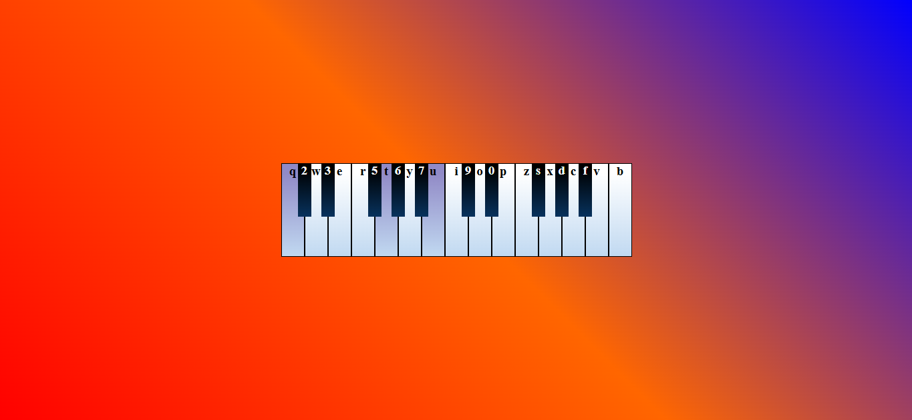

# ColoredBoard: A Scriabin-Inspired Color-Music Experience

 

An interactive web piano that visualizes Alexander Scriabin's color-note associations through dynamic background gradients. Explore the controversial but fascinating relationship between music and color as envisioned by the Russian composer.

## Key Features

- **Synesthetic Interface**: Each piano key triggers its corresponding Scriabin-associated color
- **Dynamic Gradients**: Multiple notes create blended color transitions in playing order
- **Historical Implementation**: Faithful recreation of Scriabin's clavier à lumières concept
- **Keyboard Interaction**: Play via keyboard (PC)
- **Audio-Visual Synthesis**: Integrated piano sounds with real-time color feedback

## Installation & Usage

- Clone repository:
   ```bash
   git clone https://github.com/Dmukherjeetextiles/metamusics.git
- Open index.html in a web browser

- Play using: Computer keyboard (see key labels)


## Scriabin's Color Mappings
|Musical Note|	CSS Color Variable|	HSL Value|	Scriabin's Association|
|------------|--------------------|----------|------------------------|
|C|--C|hsl(0, 100%, 50%)|Red (Material Earth)|
|C#/Db|	--Db|	hsl(271, 100%, 80%)|	Violet-Purple|
|D|	--D|	hsl(60, 100%, 50%)	|Yellow|
|D#/Eb|	--Eb|	hsl(240, 20%, 50%)|	Steel Gray|
|E|	--E|	hsl(189, 100%, 95%)|	Pearly Blue|
|F|	--F|	hsl(9, 98%, 34%)|	Deep Red|
|F#/Gb|	--Gb|	hsl(192, 100%, 50%)|	Bright Blue|
|G|	--G|	hsl(24, 100%, 50%)|	Orange|
|G#/Ab|	--Ab|	hsl(300, 100%, 50%)|	Purple|
|A	|--A|	hsl(120, 60%, 50%)|	Green|
|A#/Bb|	--Bb|	hsl(300, 1%, 55%)|	Steel Gray|
|B|	--B|	hsl(240, 100%, 50%)|	Blue|
## About Scriabin's Color Theory
This project interprets Alexander Scriabin's controversial color-music system from his unfinished work Mysterium and the tone poem Prometheus: The Poem of Fire. While modern scholars debate whether Scriabin had true synesthesia, his color associations reflect:

- Theosophical spiritual concepts

- Emotional resonance theories

- Chromatic harmonic relationships

- Proposed "total artwork" (Gesamtkunstwerk) ideals

- The color organ (clavier à lumières) implementation here follows Scriabin's 1911 mappings documented by musicologist Leonid Sabaneyev.

## Read More
Go to Wikipedia and study this [Scriabin](https://en.wikipedia.org/wiki/Alexander_Scriabin) fellow.

## Demo
You can find a basic demo [here](http://metamusics.github.io).